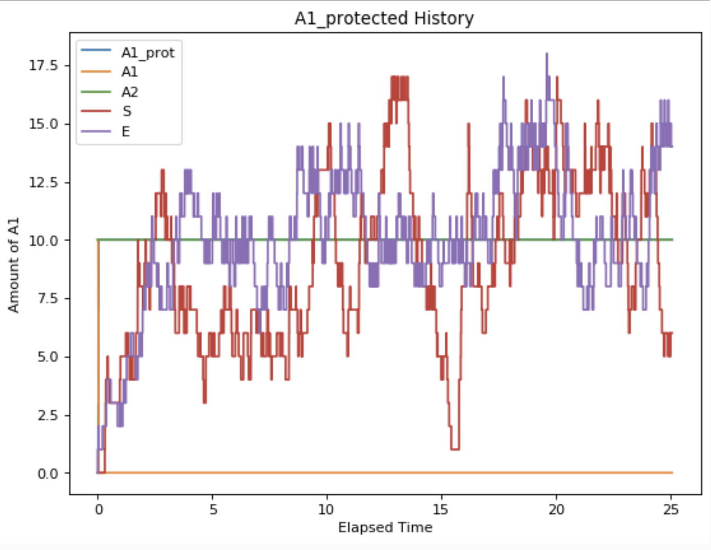
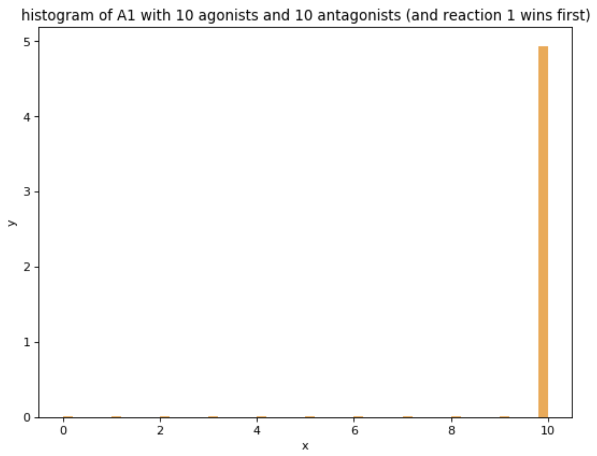
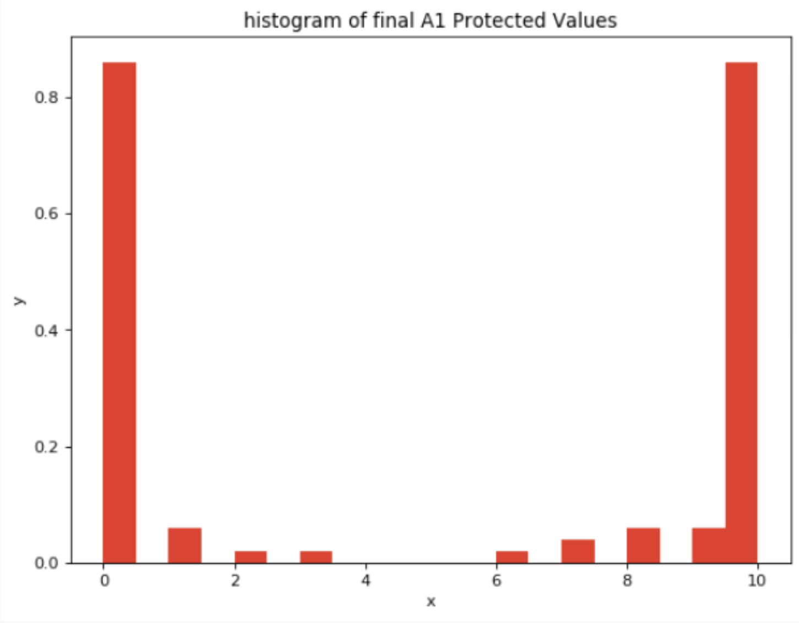
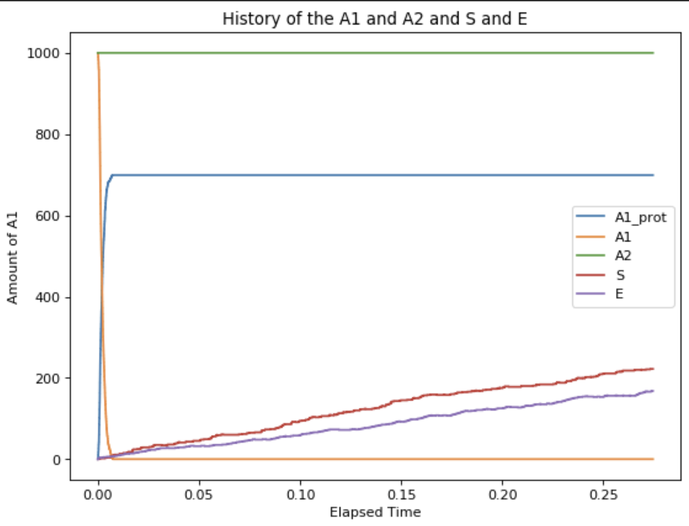
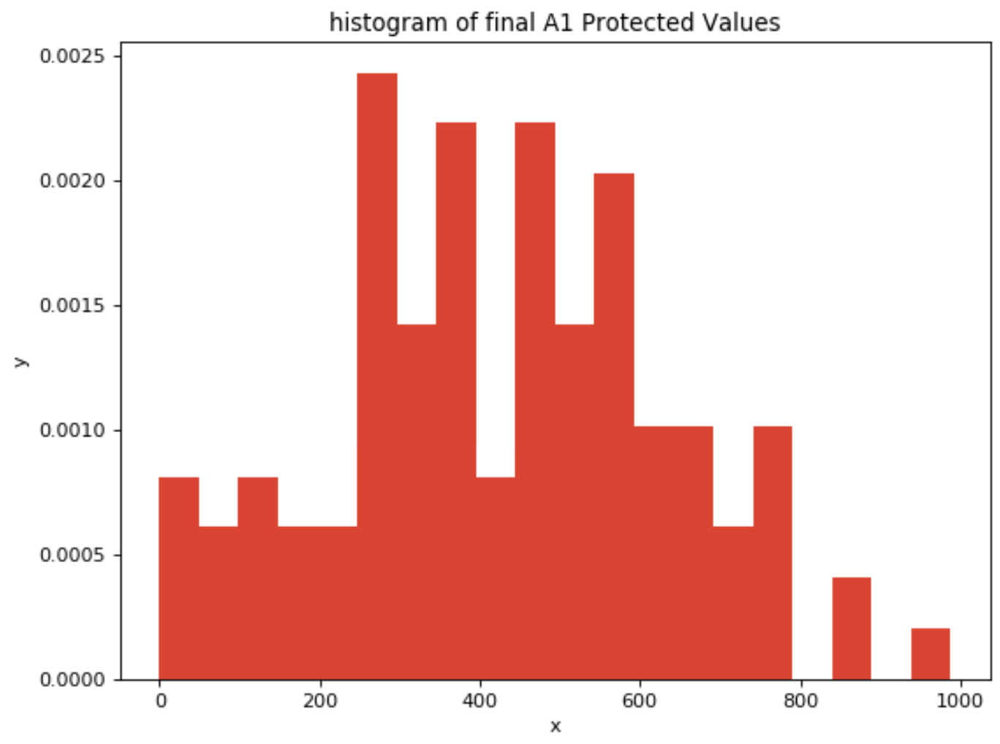
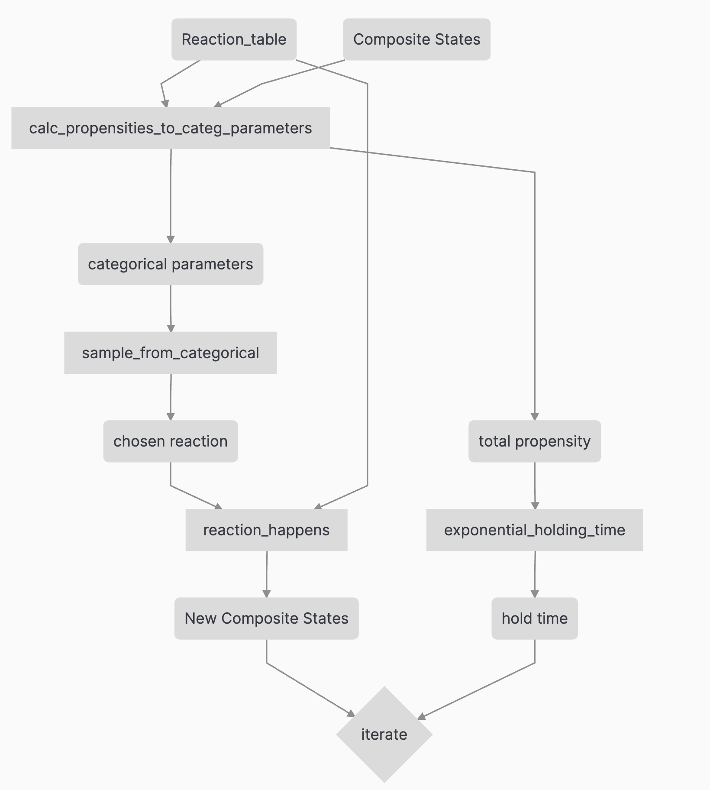
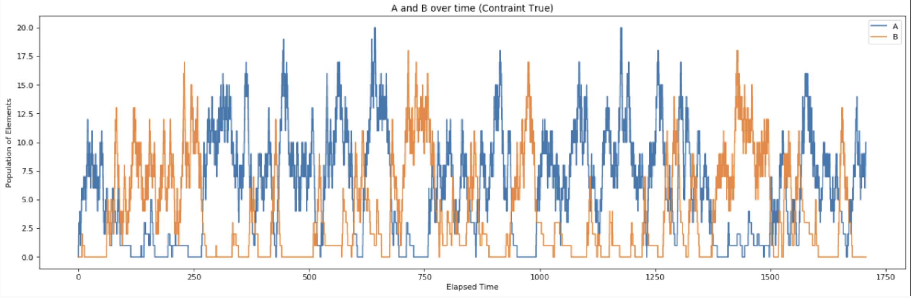
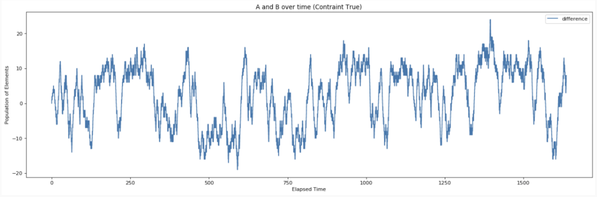
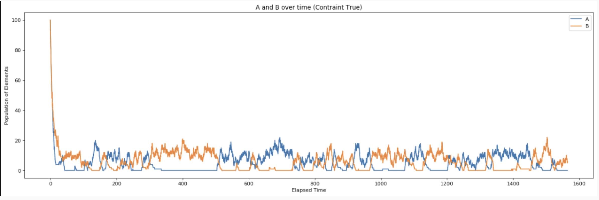
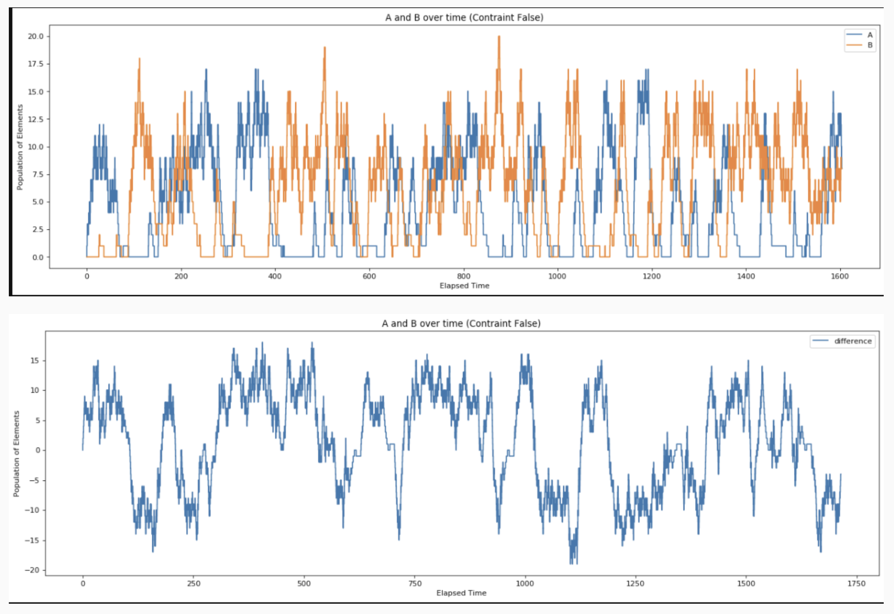

#  Stochastic Simulations - Birth Death Process
---
Tags: #math
#### Sources/References
---

##  Problem 1: Stochastic binary decisions.

Cells fate decisions are often based on small initial fluctuations that are amplified and reinforced (through feedback) over time. These events are called stochastic binary decisions (Artyomov et al., PNAS, 104, 18958, 2007). We will now simulate such a process. Consider the following set of chemical reactions:

A_1  --> E + A1			rate : k1\
A_2  --> S + A2		rate : k2\
E + A_1 --> E + A\_1		rate : k3\
A\*1 --> E + A\*1		rate : k4\
S + A_1 --> S + A_1^{inactive}		rate : k5\
S --> 0		rate : kd\
E --> 0		rate : kd\

where A1 is an agonist and A2 is its antagonist. E is an enzyme that converts A1 into its protected form A∗1 and A∗1, in turn, stimulates the production of E (positive feedback). We are interested in the steady state amount of A∗1. If S is present it can permanently de-activate A1.

(a) Start with 10 agonists and 10 antagonists with k1 \= k2 \= kd \= k4 \= 1,k3 \= 100,k5 \= 100.  
Simulate the process to completion using Gillespie’s algorithm and histogram the final amount of A∗1. Explain, in words, the result you obtain.  
(b) Repeat the simulation and histograming of part (a) starting with 1000 agonists and 1000 antagonists. Explain, in words, how your histogram differs from that of part (a).  
(c) If you had solved the corresponding rate equations explain in words what you would expect the steady state popu- lation of A∗1 to look like.


---

## 1. a)  Simulating with 10 agonists and 10 antagonists

So the first reaction that takes place is the most decisive one. In the beginning, reaction 1 and reaction 2 have an equal
chance of occuring due to A1 and A2 starting with 10 each. The following pictures are a result of running the simulations 1000 steps.

If reaction 1 happens first then E gets created and then the reaction 3 dominates (since k3 =100), thus all the A1's get converted
into A1 protected, and we end up with 10 A1 protected. We then see a fluctation between S and E as S also steadily increases as once A1 is all protected, then reaction 2 also becomes quite likely to happen.

That is what we observe in the following picture.  


The corresponding histogram to this trial is the following:


If reaction 2 were to happen first, then S gets created and all the A1's become deactivated since reaction 5 would dominate shortly after. Thus only S would be created and no A\* becomes created and because there is no A\* and no A1, then no E is created. The following diagram is representative of the this situation.


If I were to histogram 100 trials, the following emerges:


In essence, because of how small the initial values of A1 and A2 are, the final state is heavily dependent on the first reaction that takes place, which is either reaction 1 or reaction 2.


## 1. b) Simulating with 1000 agonists and 1000 antagonists
If we were to run the simulation with 1000 agonist, 1000 antagonists, then the situations are different than that of above. The number of A1 protected increases until all of A1 becomes either inactive or protected. Once that occurs then all the A1 protected remains at 600 elements due to no reverse reaction for the A1. Unlike the situation with 10 agonists and 10 antagonists there was only one apparent situation that would occur, and it didn't depend on the first few reactions.



The corresponding histogram over 100 trials looks like this:


The histogram differs from part A significantly in that the final state of A\*1 can be represented by a normal distribution centered at 500 with the bounds at 0 and 1000.


## 1. c) Steady state of A1\*1
If we had solved the corresponding rate equations, then the steady state population of A\*1 reaches around 500 elements. I ran the simulation 100 times and recorded the final A1 protected values. The main things we know about A1 protected is that $A1_{protected} + A1_{inactive} = A1_{init}$. It appears that the final value of A\*1 over 100 runs can be modeled by a normal distribution centered at 500 elements. The final state of A1\* heavily depends on the initial conditions of A1 and A2. The initial amount of A1 influences A1\* because a fraction of A1 gets converted to A1\*. The initial amount of A2 influences the final state of A1\* because the increased creation of S increases the propensity for the inactivation of A1, and thus lowers the final state of A1\*.


---
## Code for Problem 1

This time I created a set of functions that took in the item of "reaction_table" and initial conditions and amongst a few steps to calculate the new states. The round blocks are the objects, and the square boxes are functions.




```Python
from sympy.interactive import printing
printing.init_printing(use_latex=True)
import matplotlib.pyplot as plt
from matplotlib.pyplot import figure


from sympy import Eq, solve_linear_system, Matrix
from numpy import linalg
import numpy as np
import sympy as sp
from sympy import *

x, mu, sigma, w, u, v, theta, r, l, k = sp.symbols('x mu sigma w u v theta r lambda, k')

### Create the states


A1_init = 1000 ## C[0]
A2_init = 1000 ## C[1]
E_init = 0 ## C[2]
S_init = 0 ## C[3]
A1_prot_init = 0 ## C[4]
A1_inact_init = 0 ## C[5]

##for quick lookup to avoid errors
A1_idx = 0
A2_idx = 1
E_idx = 2
S_idx = 3
A1_prot_idx = 4
A1_inact_idx = 5
dead_idx = -1

## The rates
k1 = 1
k2 = 1
kd = 1
k4 = 1
k3 = 100
k5 = 100

### Lookup table of reactions so that the list of reactions can be expanded later.
reaction_table = [
    {'reactant': [A1_idx], 'product': [E_idx, A1_idx], 'rate': k1},  ## REACTION 1 >>> reactants A1 , products E and A1
    {'reactant': [A2_idx ], 'product': [ S_idx , A2_idx], 'rate': k2},  ## REACTION 2 >>> reactants A2 , products S and A2
    {'reactant': [E_idx, A1_idx], 'product': [E_idx , A1_prot_idx], 'rate': k3},  ## REACTION 3 >>> reactants E, A1 , products E and A1_prot
    {'reactant': [A1_prot_idx], 'product': [E_idx, A1_prot_idx], 'rate': k4},  ## REACTION 4 >>> reactants A1_prot , products E and A1_prot
    {'reactant': [S_idx, A1_idx], 'product': [S_idx, A1_inact_idx], 'rate': k5},  ## REACTION 5 >>> reactants S A1 , products S A1_inact
    {'reactant': [S_idx], 'product': [dead_idx], 'rate': kd},  ## REACTION 6 >>> reactants S , products nothing
    {'reactant': [E_idx], 'product': [dead_idx], 'rate': kd},  ## REACTION 7 >>> reactants S , products nothing
]

### Create each of the reactions
#### NOTE this does not work for A + A >> A2 reactions yet, code must be altered
#### RETURNS: A vector of propensities, and the total propensities
def calc_propensities_to_categ_parameters(reaction_table, C_states): ##input reaction table and states

    individual_propensities = []
    categorical_dist_parameters = []

    for i in range(len(reaction_table)):
        ## calculate the propensity for u_1
        prop = 1
        for j in range(len(reaction_table[i]['reactant'])):
            state_index = reaction_table[i]['reactant'][j] ## looking up the reactants for reaction i
            prop = prop * C_states[state_index] ## multiplying each reactant population by propensity

        prop = prop * reaction_table[i]['rate']
#         print("==> Total Propensity for reaction: ", i , " is " , prop)
        individual_propensities.append(prop)

    total_propensity = sum(individual_propensities)   
    for i in range(len(individual_propensities)):
        ## sum the propoensities and divide it in each of the individual propensities and append to categorical_dist_parameters
        categorical_dist_parameters.append(individual_propensities[i] / total_propensity)


    return categorical_dist_parameters, total_propensity

## Purpose: Given the parameters calculated from propensities, use FToS to select a reaction
def sample_from_categorical(parameters, u):
    payload = 0
    count = 0
    while (u > payload):
        payload += parameters[count]
        count += 1
    return count-1

## Purpose: using FTOS to sample a holding time.
def exponential_holding_time(lambda_parameter, uniformly_sampled):
    l_s = lambda_parameter
    inverse_cdf = - 1 / l_s * log(1 - u)
    holding_time = inverse_cdf.subs(u, uniformly_sampled)
    return holding_time


## Purpose: to take the chosen reaction and enact changes on C_states
## input: reaction_table : the lookup table that has the information on reactions
## input: reaction_idx : indicates which reaction has been selected from before
## input: C_states :  the current composite states
def reaction_happens(reaction_table, reaction_idx, C_states):
    reactant_list = reaction_table[reaction_idx]['reactant']
#     print("REACTANT LIST: ", reactant_list)
    product_list = reaction_table[reaction_idx]['product']
    new_c_states = C_states
    ## take away reactants
    for i in range(len(reactant_list)):
        state_idx = reactant_list[i]
        new_c_states[state_idx] = C_states[state_idx] - 1

    ## add products
    for i in range(len(product_list)):
        state_idx = product_list[i]
        if(state_idx >= 0):
            new_c_states[state_idx] = C_states[state_idx] + 1

    return new_c_states

#########################
## Beginning of Gillispie Simulation
#########################

C_states = [A1_init, A2_init, E_init, S_init, A1_prot_init, A1_inact_init]

print(C_states)

C_states_history = []
A1_hist = []
A2_hist = []
E_hist = []

holding_times_history = []
total_time = 0

C_states_history.append(list(C_states))
holding_times_history.append(0)

for i in range(1300):
    ### putting the code together

    ## 1. Sample the reaction that will take place
    parameters, tot_prop = calc_propensities_to_categ_parameters(reaction_table, C_states)
#     print(C_states)
#     print(parameters)

    u = np.random.uniform(0,1,1)[0]
#     print("\t sampled u: => ", u)
    reaction_idx = sample_from_categorical(parameters, u)
#     print("\t REACTION: => ", reaction_idx)
    ## update C_states based on the reaction chosen

    C_states = reaction_happens(reaction_table, reaction_idx, C_states)
    C_states_history.append(list(C_states))

    h_time = exponential_holding_time(tot_prop, np.random.uniform(0,1,1)[0])
    total_time += h_time
    holding_times_history.append(total_time)
# print(C_states_history)

### convert the states into a numpy array to be sliced
a = np.array(C_states_history)
A1_hist = a[:,A1_idx]
A2_hist = a[:,A2_idx]
S_hist = a[:, S_idx]
E_hist = a[:, E_idx]
A1_prot_history = a[:,A1_prot_idx]

# print((A1_prot_history))
# print((holding_times_history))

### Graph the elements
figure(num=None, figsize=(8, 6), dpi=80, facecolor='w', edgecolor='k') ## just code for enlarging the graph

plt.step(holding_times_history , A1_prot_history, label="A1_prot")
plt.step(holding_times_history, A1_hist, label="A1")
plt.step(holding_times_history , A2_hist, label="A2")
plt.step(holding_times_history , S_hist, label="S")
plt.step(holding_times_history , E_hist, label="E")

plt.title('History of the A1 and A2 and S and E')
plt.legend()
plt.ylabel('Amount of A1')
plt.xlabel('Elapsed Time');


### Code for the histogram:
# graphing the histogram
figure(num=None, figsize=(8, 6), dpi=80, facecolor='w', edgecolor='k') ## just code for enlarging the graph
plt.hist(A1_prot_history, density=True, bins=50, color = "Orange")  
plt.title('histogram of A1 protected with 1000 agonists and 1000 antagonists')
plt.ylabel('y')
plt.xlabel('x');

# graphing the histogram of the A1_protected final values
figure(num=None, figsize=(8, 6), dpi=80, facecolor='w', edgecolor='k') ## just code for enlarging the graph
plt.hist(avg_steady_states, density=True, bins=20, color = "Red")  
plt.title('histogram of final A1 Protected Values')
plt.ylabel('y')
plt.xlabel('x');

```

---

# Problem 2: The genetic toggle switch and stochastic bistability.

The toggle switch (Gardner et al. Nat. 403, 339-342) is a common feedback loop motif in systems biology and it exhibits a fascinating behavior called ‘stochastic bistability’. We will now simulate this behavior. Consider the following chemical reactions involving two proteins, A and B:

A --> 0			k_d\
B --> 0 			k_d\
g_A --> g_A + A			kp\
g_B -->	gB + B			kp\
gA + B  <--> gA\*			kf, kr \
gb + A <--> gB\*				kf, kr


where kd are degradation rates and kp are production rates for both proteins. gA is the gene responsible for the production of A which can converted into an inactive form gA∗ by binding to B. Vice versa for gB. Assume you only have one gene available in the cell so that gA \+ gA∗ \= 1 and gB \+ gB∗ \= 1. Also, assume throughout that gA∗ \+ gB∗ \= 1, kd <kp andkr <kfnB,kfnA.

---

### (a) Simulate the chemical reactions starting with nA \= 0 and nB \= 0 for many time steps. Adjust your rates until you see stochastic switching events between periods when A exceeds B in number and B exceeds A in number. You should see stochastic hopping between two solutions (which we call “fixed points").  



Graphing the difference between A and B yields the following:


The fixed points that the toggle switch tend to hop at in the following picture is -10 and 10.

```
## The rates
kd = 0.3
kp = 3
kf = 0.03
kr = 0.1

```

###  (b) Would you expect to see this stochastic switching occur if you had started with a large amount of nA and nB initially? In technical language, qualitatively explain (in words) how the fixed point structure changes for the corresponding rate equations.



The fixed point structure does not depend on the initial conditions of A and B content. The same fixed points seen in part (a) can be seen in the graph above. Thus showing that incredibly high initial conditions don't change the steady states.


### (c) The condition that gA∗ \+ gB∗ \= 1 is called the exclusive switch. Relax this condition and re-simulate the toggle switch. What new fixed point appears?



A new fixed point that appears when the third constraint has been relaxed is at 0. This is the three constraints set up in the prompt force the steady state to either have higher amounts of A or higher amounts of B.

1. gA + gA\* = 1
2. gB + gB\* = 1
3. gA\* + gB\* = 1

When the forward reaction for gA\* occurs, thus the other 3 values gA and gB and gB\* are forced to become 0, 1 and 0 respectively. Likewise when the forward reaction for gB\* occurs,  the other 3 values gA and gB and gA\* are forced to become 1, 0 and 0 respectively. This constraint prevented the production of A or B at the same time, thus preventing any 0 fixed point as a possible steady state.

However, by relaxing this constraint, 0 emerges a as a fixed point in the activation of both gA and gB.


---


## Code for Problem 2:

Most of the code used in problem 2 is from problem 1. The main difference is that the reaction table has been replaced and different starting conditions. The function for reaction_happens was replaced with reaction_happens_q2 which incorporated the constraint gA\* + gB\* = 1


``` Python

### New version of reaction_happens from question 1 to incorporate the constraint which can be true or false
def reaction_happens_q2(reaction_table, reaction_idx, C_states, constraint):
    reactant_list = reaction_table[reaction_idx]['reactant']
    product_list = reaction_table[reaction_idx]['product']
    new_c_states = C_states

    ## take away reactants
    for i in range(len(reactant_list)):
        state_idx = reactant_list[i]
        new_c_states[state_idx] = C_states[state_idx] - 1

    ## add products
    for i in range(len(product_list)):
        state_idx = product_list[i]
        if(state_idx >= 0):
            new_c_states[state_idx] = C_states[state_idx] + 1

    if(constraint == True):
        if(reaction_idx == 4): ## forward reaction for gA + B to create gA*
            new_c_states[gB_prot_idx] = 0
            new_c_states[gA_prot_idx] = 1

            new_c_states[gB_idx] = 1
            new_c_states[gA_idx] = 0

        elif(reaction_idx == 5): ## reverse reaction for gA* to create gA + B
            new_c_states[gB_prot_idx] = 1
            new_c_states[gA_prot_idx] = 0

            new_c_states[gB_idx] = 0
            new_c_states[gA_idx] = 1

        elif(reaction_idx == 6): ## forward reaction for gB to create gB*
            new_c_states[gA_prot_idx] = 0
            new_c_states[gB_prot_idx] = 1

            new_c_states[gB_idx] = 0
            new_c_states[gA_idx] = 1

        elif(reaction_idx == 7): ## reverse reaction for gB* to create gB
            new_c_states[gA_prot_idx] = 1
            new_c_states[gB_prot_idx] = 0

            new_c_states[gB_idx] = 1
            new_c_states[gA_idx] = 0


    return new_c_states


####################

## Gillispie simulation

A_init = 0 ## C[0]
B_init = 0 ## C[1]
gA_init = 1 ## C[2]
gB_init = 1 ## C[3]
gA_prot_init = 0 ## C[4]
gB_prot_init = 0 ## C[5]

##for quick lookup to avoid errors
A_idx = 0
B_idx = 1
gA_idx = 2
gB_idx = 3
gA_prot_idx = 4
gB_prot_idx = 5
dead_idx = -1

## The rates
kd = 70
kp = 100
kf = 30
kr = 40

gA_gB_constraint = False

reaction_table = [
    {'reactant': [A_idx], 'product': [dead_idx], 'rate': kd},  ## REACTION 1 >>> reactants A , products nothing
    {'reactant': [B_idx ], 'product': [ dead_idx ], 'rate': kd},  ## REACTION 2 >>> reactants B , products nothing
    {'reactant': [gA_idx], 'product': [gA_idx , A_idx ], 'rate': kp},  ## REACTION 3 >>> reactants A , products gA and A
    {'reactant': [gB_idx], 'product': [gB_idx, B_idx], 'rate': kp},  ## REACTION 4 >>> reactants gB , products gB and B
    {'reactant': [gA_idx, B_idx], 'product': [gA_prot_idx], 'rate': kf},  ## REACTION 5 >>> reactants gA and B , products gA protected
    {'reactant': [gA_prot_idx], 'product': [gA_idx, B_idx], 'rate': kr},  ## REACTION 6 >>> reactants gA protected , products gA and B
    {'reactant': [gB_idx, A_idx], 'product': [gB_prot_idx], 'rate': kf},  ## REACTION 7 >>> reactants gB and A , products gB protected
    {'reactant': [gB_prot_idx], 'product': [gB_idx, A_idx], 'rate': kr},  ## REACTION 8 >>> reactants gB protected , products gB and A
]


C_states = [A_init, B_init, gA_init, gB_init, gA_prot_init, gB_prot_init]

C_states_history = []


holding_times_history = []
total_time = 0

C_states_history.append(list(C_states))
holding_times_history.append(0)

for i in range(1500):
    ### putting the code together

    ## 1. Sample the reaction that will take place
    parameters, tot_prop = calc_propensities_to_categ_parameters(reaction_table, C_states)

    reaction_idx = sample_from_categorical(parameters, np.random.uniform(0,1,1)[0])
    ## update C_states based on the reaction chosen
    C_states = reaction_happens_q2(reaction_table, reaction_idx, C_states, gA_gB_constraint)
    C_states_history.append(list(C_states))

#     if((C_states[gA_prot_idx] + C_states[gB_prot_idx]) != 1):
#         print("sum is not 1: ", C_states, " reaction : ", int(reaction_idx))
#     else:
#         print("sum is 1: ", C_states)

    h_time = exponential_holding_time(tot_prop, np.random.uniform(0,1,1)[0])
    total_time += h_time
    holding_times_history.append(total_time)


# print(C_states_history)

a = np.array(C_states_history)
A_hist = a[:,A_idx]
B_hist = a[:,B_idx]
gA_hist = a[:,gA_idx]
gB_hist = a[:,gB_idx]
gA_prot_hist = a[:,gA_prot_idx]
gB_prot_hist = a[:,gB_prot_idx]


figure(num=None, figsize=(20, 6), dpi=80, facecolor='w', edgecolor='k') ## just code for enlarging the graph

plt.step(holding_times_history , A_hist, label="A")
plt.step(holding_times_history, B_hist, label="B")

# plt.step(holding_times_history, gA_hist, label="gA")
# plt.step(holding_times_history, gB_hist, label="gB")

# plt.step(holding_times_history, gA_prot_hist, label="gA_prot")
# plt.step(holding_times_history, gB_prot_hist, label="gB_prot")


plt.title('A and B over time (Contraint False)')
plt.legend()
plt.ylabel('Population of Elements')
plt.xlabel('Elapsed Time');


```
